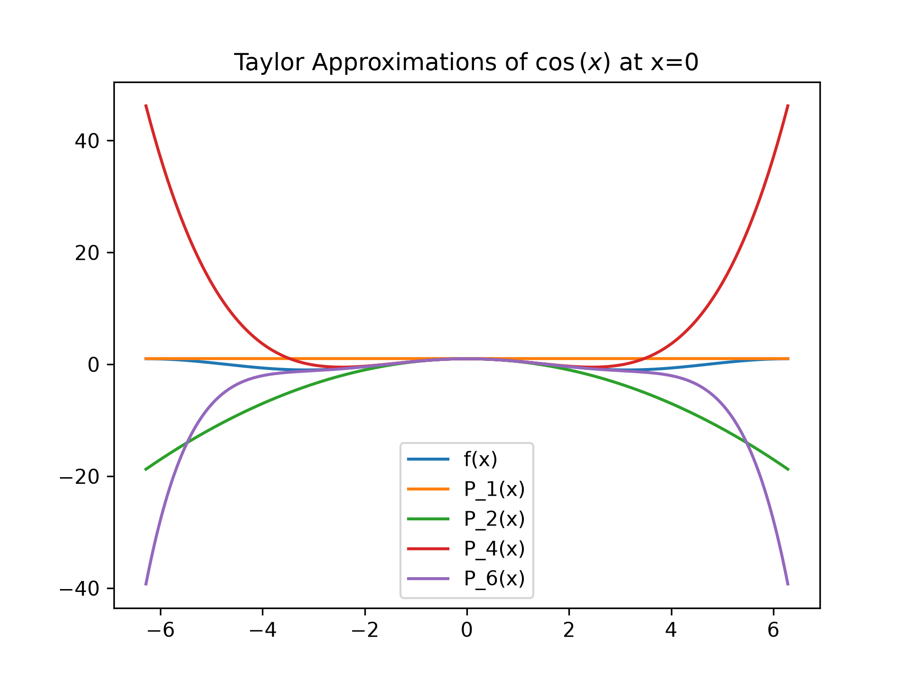
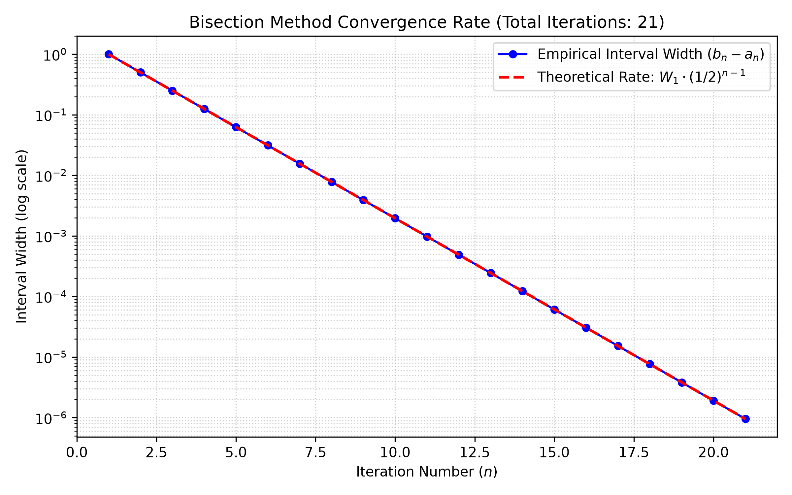

# Numerical Analysis Assignment 1 — Report

**Name:** 
Hamza Faisal
Burhanuding Patanwalla
Hussam Zubair
Sarmad Ansari
Mujtaba Zaidi

---

## 1. Overview

we basically wrote two scripts to test and experiment with taylors series and the bisection iteration method. Our goal was to explore edgecases and see a practical implementation of the two algorithms in actual use

---

## 2. Design choices

### 2.1 Error handling (both files)

We only really implemented error handling only when our scripts ran into preset violations or invalid user inputs
We define invalid user inputs as inputs where the function becomes undefined or unexecutable
- The following are types of errors we have in our scripts:
	- A `TypeError` is raised when the objective function $f$ is not callable
	- A `ValueError` is raised when interval boundaries violate $a < b$, numerical parameters are invalid ($\text{tol} \le 0$ or $\text{max\_iter} \le 0$ )
- There are situations where we dont have an error such as: 
	- **exhausting `max_iter` without meeting the convergence tolerance does NOT raise an exception**; instead, `bisection()` returns normally with `"converged": False`, the latest midpoint $p_n$, an explanatory `"reason"`, and the iteration history.
### 2.2 Relative-error safeguard (bisection)

The standard relative error formula:

$$\text{rel\_err} = \frac{\vert{}p_n - p_{n-1}\vert{}}{\vert{}p_n\vert{}}$$

breaks down when the true root is at or near zero ($p_n \approx 0$). As our denominator aproaches zero, our floating point division ends up creating division by zero overflow. This would artificially blow up our relative errors even when our interval is tight around the root

The function checks how big the current point is compared to that threshold. When it drops below 1e-12 it just switches to the plain absolute difference instead of trying the relative version. That stops weird non convergence near the origin without changing how the error behaves everywhere else.

We picked 1e-12 because it sits above machine precision which is around 2e-16 so only the really tiny cases trigger it. I think the exact value is kind of arbitrary though and maybe another number close to it would have worked the same. It seems safe enough for what they needed.
### 2.3 How taylor_series works

Inside the taylor series function the loop runs through each order from zero up to $n$. For every step it grabs the $k^{th}$ derivative and then substitutes the expansion point right into that result. After dividing by the factorial it multiplies by the power term and adds everything to the running polynomial. 

The lagrange remainder gets built by taking the next derivative and evaluating it at a fresh unevaluated $x_i$ symbol. The expression comes back without any simplification applied. 
$$
Rn​(x)= \frac{f(n+1)(ξ)}{(n+1)!}​(x−x0​)^{n+1}
$$

---

## 3. Problem 1 — Taylor series results

### (i) e^x about 0, evaluated at x = 0.5

| n   | P_n(0.5)           | absolute error          | relative error          |
| --- | ------------------ | ----------------------- | ----------------------- |
| 1   | $1.50000000000000$ | $0.148721270700128$     | $0.0902040104310499$    |
| 3   | $1.64583333333333$ | $0.00288793736679493$   | $0.00175162255629090$   |
| 5   | $1.64869791666667$ | $0.0000233540334615423$ | $0.0000141649373223802$ |
As $n$ increases, the error decays rapidly, directly matching the Lagrange remainder bound $R_n(x) \le \frac{e^{0.5}}{(n+1)!}(0.5)^{n+1}$ where the factorial in the denominator quickly dominates the power term.

### (ii) sin(x) about 0, n = 7

- **Terms list:** `[0, x, 0, -x**3/6, 0, x**5/120, 0, -x**7/5040]`

All even-order terms vanish because $\sin(x)$ is an odd function, meaning all of its even-order derivatives are proportional to $\pm \sin(x)$. Evaluating any even derivative at the expansion point $x_0 = 0$ yields $\sin(0) = 0$, giving coefficient contributions of zero for every even $k$.

### (iii) ln(x) about 1, n = 4

- $P_4(1.2) = 0.182266666666667$
- $\ln(1.2) = 0.182321556793955$
- **Absolute error:** $0.0000548901272879598$
- **Relative error:** $0.000301062190632742$
    
This is an accurate approximation (relative error $\approx 0.03\%$) because $x = 1.2$ lies very close to the center of expansion $x_0 = 1$ and well inside the interval of convergence $(0, 2]$.
### (iv) 1/(1-x) about 0, n = 5

| x   | P_5(x)             | true value          | absolute error     | relative error      |
| --- | ------------------ | ------------------- | ------------------ | ------------------- |
| 0.9 | $4.68559000000000$ | $10.0000000000000$  | $5.31441000000000$ | $0.531441000000000$ |
| 1.5 | $20.7812500000000$ | $-2.00000000000000$ | $22.7812500000000$ | $11.3906250000000$  |

**Convergence & Error Analysis Across Orders:**

| **n**  | **Absolute Error at x=0.9** | **Absolute Error at x=1.5** |
| ------ | --------------------------- | --------------------------- |
| **5**  | $5.3144 \times 10^{0}$      | $2.2781 \times 10^{1}$      |
| **10** | $3.1381 \times 10^{0}$      | $8.6498 \times 10^{1}$      |
| **20** | $1.0942 \times 10^{0}$      | $4.9891 \times 10^{3}$      |
| **50** | $5.1538 \times 10^{-3}$     | $9.5670 \times 10^{8}$      |

- **Radius of Convergence:** The geometric series $\frac{1}{1-x} = \sum_{k=0}^{\infty} x^k$ has a radius of convergence $R = 1$ (convergence interval $(-1, 1)$), dictated by the singular pole at $x = 1$.
- **Inside vs. Outside:** $x = 0.9$ lies inside the radius of convergence ($\vert{}0.9\vert{} < 1$), whereas $x = 1.5$ lies strictly outside ($\vert{}1.5\vert{} > 1$).
- **Behavior as $n$ Grows:** For $x = 0.9$, the error eventually contracts toward zero as $n \to \infty$, whereas for $x = 1.5$, the partial sums diverge wildly to $+\infty$, leading to catastrophic errors.    
- **Convergence Near the Boundary:** At $n = 5$, the error at $x = 0.9$ is over $53\%$, which is demonstrably poor. Because $x = 0.9$ is right near the boundary $R = 1$, the ratio term $x^{n+1} = 0.9^{n+1}$ decays slowly, proving that proximity to the boundary severely impairs the convergence rate of Taylor polynomials.

### (v) Edge cases

| Invalid call                | Exception raised | Message                                                                    |
| --------------------------- | ---------------- | -------------------------------------------------------------------------- |
| n = -1 / non-integer n      | ValueError       | n must be a positive integer                                               |
| expr with no free symbols   | ValueError       | 0 or > 1 free symbols                                                      |
| expr with 2 symbols, no var | ValueError       | 0 or > 1 free symbols                                                      |
| Abs(x) at 0                 | ValueError       | derivative not defined at 0 for n = 1, function is not differentiable at 0 |
| sqrt(x) at 0                | ValueError       | derivative not defined at 0 for n = 1, limit goes to infinity              |

For $n = 0$, the function evaluates only the constant zeroth-order term $f(x_0)$ (e.g., returning $4$ for $x^2$ at $x_0 = 2$). When given a symbolic expansion point $x_0$, the function handles it symbolically without error, yielding $\ln(x_0) + \frac{x - x_0}{x_0}$ for $\ln(x)$.
### (vi) cos(x) plot

Each Taylor polynomial $P_n(x)$ matches $\cos(x)$ around the expansion center $x_0 = 0$, but diverges away from the true function as $\vert{}x\vert{}$ moves farther from the origin. Lower orders like $P_1(x) = 1$ and $P_2(x) = 1 - \frac{x^2}{2}$ break down before reaching $x = \pm 2$, while $P_6(x)$ traces the curve out toward $\pm \pi$. Increasing $n$ expands the interval around $x_0 = 0$ over which the polynomial approximation remains visually indistinguishable from the true cosine wave.

---

## 4. Problem 2 — Bisection results

### (i) x^3 - x - 2 on [1, 2], interval criterion, tol = 1e-6

- **Root:** $1.5213799476623535$
- **Actual Iterations:** $21$
- **A Priori Iterations:** $20$ ($\lceil \log_2((2 - 1)/10^{-6}) \rceil = 20$)
    
#### **Why they differ by 1:**
$N = \lceil \log_2((b-a)/\text{tol}) \rceil = 20$ measures required halvings. The code checks `interval_w < tol` at the start of the loop _before_ halving for that step, requiring one extra check ($n = 21$) to register the halved width below $10^{-6}$.

### (ii) Comparison of stopping criteria (tol = 1e-6)

| Criterion | Iterations | Root         |
| --------- | ---------- | ------------ |
| absolute  | 20         | $1.52138042$ |
| relative  | 20         | $1.52138042$ |
| interval  | 21         | $1.52137995$ |
| residual  | 22         | $1.52137971$ |
| all       | 22         | $1.52137971$ |
- Step vs. Width: $\vert{}p_n - p_{n-1}\vert{} = w_n / 2$, so displacement tests reach tolerance one iteration before interval width.
- Residual: Near the root, $\vert{}f(p)\vert{} \approx \vert{}f'(\alpha)\vert{} \cdot \vert{}p - \alpha\vert{} \approx 5.94 \cdot \vert{}p - \alpha\vert{}$. The slope amplifies error, making residual stricter and slower.
- "All": Bottlenecks at the slowest criterion (residual).
- A Priori Accuracy: Derived for interval width, it under-predicts when the slope $\vert{}f'\vert{} > 1$ (20 vs 22 for residual).   

### (iii) Failure modes

| Case                      | Result     | Message / Outcome                                                                                                      |
| ------------------------- | ---------- | ---------------------------------------------------------------------------------------------------------------------- |
| a >= b                    | ValueError | Endpoint 'a' must be strictly less than 'b' (a < b). Got a = 2.0, b = 1.0.                                             |
| same sign                 | ValueError | Root is not bracketed: f(a) and f(b) must have opposite signs (f(a)*f(b) < 0). Got f(-0.5) = -0.75 and f(0.5) = -0.75. |
| f(a) = 0                  | Return     | Root = 1.0, Iters = 0, Reason = 'Exact root found at left boundary a.'                                                 |
| f(b) = 0                  | Return     | Root = 3.0, Iters = 0, Reason = 'Exact root found at right boundary b.'                                                |
| tol <= 0                  | ValueError | Tolerance has to be greater than 0                                                                                     |
| max_iter <= 0             | ValueError | Number of iteration cant be 0 or less than 0                                                                           |
| bad error_type            | ValueError | kindly enter a acceptable error type (absolute, relative, residual, interval, all)                                     |
| f not callable            | TypeError  | Parameter 'f' must be a callable function... If you passed a SymPy expression, convert it using sympy.lambdify.        |
| max_iter too low          | Return     | Converged = False, Reason = 'Maximum iterations (3) reached without satisfying stopping criterion 'absolute'.'         |
| relative error near p ≈ 0 | Return     | Root = -9.09e-13, Iters = 40, Converged = True                                                                         |
_Design choice:_ Exhausting iterations is an algorithm status, not invalid usage, so it returns diagnostic state instead of crashing.

### (iv) sin(4*pi*x)

- **On $[0, 1]$:** $f(0) = 0$ short-circuits at iteration 0, returning $0.0$ immediately.
- **Bracket $[0.1, 0.9]$:** Valid because $f(0.1) \approx 0.95 > 0$ and $f(0.9) \approx -0.95 < 0$. Contains roots at $0.25, 0.5, 0.75$ and converges to **$0.25$**.
- **Trace:** $p_1 = 0.5$ ($f=0$, shifts $a \leftarrow 0.5$) $\to$ $p_2 = 0.3$ ($f < 0$, shifts $b \leftarrow 0.3$) $\to$ $p_3 = 0.2$ ($f > 0$, shifts $a \leftarrow 0.2$) $\to$ contracts to $0.25$.
### (v) Convergence plot

- **Match:** Empirical matches the theoretical $w_1 (1/2)^{n-1}$ line exactly.
- **Slope:** $\log_{10}(0.5) \approx -0.301$ decades/iteration.
- **Exactness:** Bisection divides the interval in half by construction every step, independent of the function.
---

## 5. Known limitations

- **Sign-change restriction:** Cannot find roots of even multiplicity where $f(x)$ touches zero without crossing (e.g., $x^2 = 0$).
- **Single-root capture:** Misses other solutions in multi-root intervals (e.g., $\sin(4\pi x)$), trapping whichever root matches the initial midpoint sign.
- **Discontinuity failure:** False-converges on vertical asymptotes (e.g., $1/x$ on $[-1, 1]$).
- **Arbitrary safeguard:** The $\epsilon = 10^{-12}$ fallback for relative error near zero is a heuristic, not mathematically optimal for all scales.
- **Univariate only:** Taylor series only works for one variable.
- **Point-only derivative check:** SymPy checks differentiability only at $x_0$, ignoring singularities elsewhere in the domain.

---

## 6. AI use disclosure

> TODO: The assignment requires detail on extent and purpose. State plainly what you
> actually did, e.g. what you asked an AI tool to do (review code against the spec,
> explain what the report should contain, ...), what it did NOT do, and which
> suggestions you applied. Be accurate — this section is graded on honesty.
